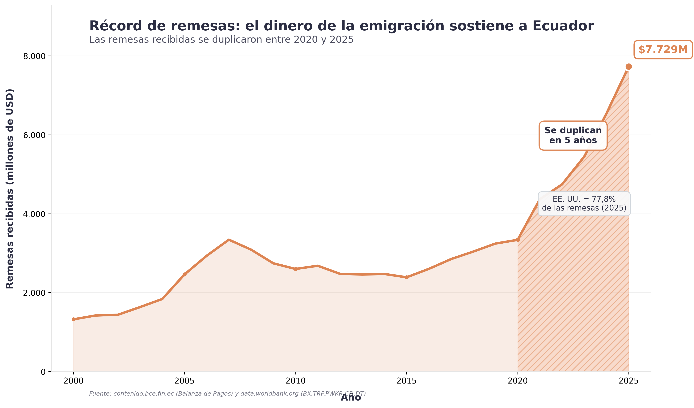
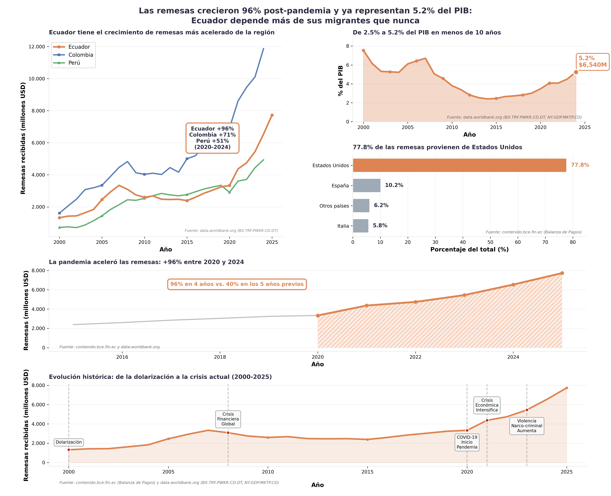

# Ecuador Quantificado: Las Remesas Como Pilar Económico

> **Visualización de datos para el concurso Ecuador Quantificado 2026**
> **Mensaje central:** Las remesas no son solo ayuda familiar—se han convertido en un pilar estructural de la economía ecuatoriana, reflejando una crisis migratoria sin precedentes.

---

## 🎯 El Insight Principal (No Obvio)

**La mayoría ve:** "Las remesas se duplicaron entre 2020 y 2025"

**Lo que revelan los datos:** Las remesas pasaron de ser **ayuda complementaria (2.5% del PIB)** a **pilar económico estructural (5.2% del PIB)** en menos de 10 años. Esta transformación es más acelerada que en Colombia o Perú, señalando una crisis migratoria única en la región.

### Tres Hallazgos Clave

1. **Aceleración Post-Pandemia (+96% en 4 años)**
   Mientras Colombia creció 71% y Perú 51% en el mismo período (2020-2024), Ecuador creció 96%. Esta es la **tasa de crecimiento más alta de Sudamérica**.

2. **Peso Económico sin Precedentes (5.2% del PIB en 2024)**
   Las remesas ya superan sectores tradicionales y rivalizan con las exportaciones petroleras. En 2025, superaron el financiamiento externo total del país ($7,729M vs $4,520M).

3. **Dependencia de EE.UU. (77.8% del origen)**
   El flujo está concentrado en un único país, evidenciando un patrón migratorio específico hacia Estados Unidos, vinculado a crisis económica, desempleo y violencia narco-criminal.

---

## 📊 Las Visualizaciones

### Versión Original: Mensaje Claro
**`output/remesas_ecuador.png`** - Visualización limpia que muestra la duplicación 2020-2025.



**Fortalezas:**
- ✅ Mensaje directo y contundente
- ✅ Accesible (colorblind-friendly, patrones)
- ✅ Fuentes verificables

### Versión Mejorada: Análisis Profundo
**`output/remesas_ecuador_enhanced.png`** - Visualización multi-panel con contexto regional, histórico y económico.



**Panel A - Comparación Regional:** Ecuador vs Colombia vs Perú
**Panel B - El Verdadero Peso:** Remesas como % del PIB (2.5% → 5.2%)
**Panel C - La Aceleración:** +96% en solo 4 años post-pandemia
**Panel D - Contexto Histórico:** Timeline con eventos clave (crisis financiera 2008, COVID-19, violencia narco-criminal)

**Fortalezas adicionales:**
- ✅ Contexto regional único
- ✅ Narrativa histórica
- ✅ Múltiples insights en una sola figura
- ✅ Ángulo original: % del PIB (no solo valores absolutos)

---

## 🔍 Metodología y Fuentes

### Datos Utilizados

1. **Remesas Recibidas**
   - Fuente primaria: [data.worldbank.org](https://data.worldbank.org) - Indicador `BX.TRF.PWKR.CD.DT`
   - Fuente secundaria: [contenido.bce.fin.ec](https://contenido.bce.fin.ec) - Balanza de Pagos
   - Países: Ecuador, Colombia, Perú
   - Rango: 2000-2025

2. **PIB Nacional**
   - Fuente: [data.worldbank.org](https://data.worldbank.org) - Indicador `NY.GDP.MKTP.CD`
   - País: Ecuador
   - Rango: 2000-2024

3. **Contexto Migratorio**
   - Fuente: [OIM Ecuador](https://ecuador.iom.int/) - Análisis de flujos migratorios
   - Fuente: Investigación académica sobre crisis migratoria ecuatoriana

### Transparencia Metodológica

**Datos del Banco Mundial:**
- Serie histórica completa 2000-2022 vía API
- Datos actualizados automáticamente

**Datos del BCE:**
- Años 2023-2025 (más recientes que World Bank)
- Cada registro tiene columna `fuente` para trazabilidad

**Cálculo de % del PIB:**
```python
remesas_pct_pib = (remesas_millones_usd / gdp_millones_usd) * 100
```

Todos los cálculos son reproducibles ejecutando:
```bash
python fetch_data.py
python fetch_enhanced_data.py
```

---

## 🚀 Cómo Reproducir

### Requisitos Previos
- Python 3.8 o superior
- Conexión a internet (para APIs del Banco Mundial)

### Instalación

```bash
# 1. Crear entorno virtual
python3 -m venv venv
source venv/bin/activate  # Windows: venv\Scripts\activate

# 2. Instalar dependencias
pip install -r requirements.txt
```

### Ejecución Completa

```bash
# Opción A: Visualización original (simple)
python fetch_data.py && python make_chart.py

# Opción B: Visualización mejorada (análisis completo)
python fetch_data.py && \
python fetch_enhanced_data.py && \
python make_enhanced_chart.py
```

**Tiempo estimado:** 30-60 segundos (depende de velocidad de API)

---

## 📁 Estructura del Proyecto

```
ecuador_quantificado_remesas_brief/
├── README.md                              # Este archivo
├── ecuador_quantificado_remesas_brief.md  # Brief original del proyecto
├── requirements.txt                       # Dependencias Python
│
├── fetch_data.py                          # Script 1: Datos básicos (World Bank + BCE)
├── fetch_enhanced_data.py                 # Script 2: Datos avanzados (PIB, regional)
├── make_chart.py                          # Visualización original
├── make_enhanced_chart.py                 # Visualización mejorada ⭐
│
├── data/
│   ├── remesas_ecuador.csv                # Remesas Ecuador 2000-2025
│   ├── ecuador_gdp.csv                    # PIB Ecuador 2000-2024
│   ├── ecuador_remesas_pib.csv            # Remesas como % del PIB
│   ├── colombia_remesas.csv               # Remesas Colombia (comparación)
│   └── remesas_regional.csv               # Remesas Ecuador + Colombia + Perú
│
└── output/
    ├── remesas_ecuador.png                # Visualización original
    ├── remesas_ecuador_social.png         # Versión social media
    └── remesas_ecuador_enhanced.png       # Visualización mejorada ⭐
```

---

## 💡 Por Qué Este Análisis Es Único

### 1. Enfoque en el Impacto Económico Real
La mayoría de análisis se quedan en valores absolutos. Este proyecto muestra **el peso relativo** de las remesas en la economía (% del PIB), revelando que ya no son marginales sino estructurales.

### 2. Comparación Regional Contextualizada
Ecuador no está solo, pero su aceleración post-2020 es **significativamente más rápida** que Colombia o Perú, indicando factores únicos (violencia, crisis política, desempleo).

### 3. Narrativa Temporal con Eventos Históricos
Los datos no existen en el vacío. La visualización relaciona picos y cambios con:
- Crisis Financiera Global (2008)
- COVID-19 y colapso económico (2020)
- Intensificación de violencia narco-criminal (2021-2023)

### 4. Ángulo Social, No Solo Económico
Las remesas no son "ingresos". Son el reflejo financiero de **cientos de miles de familias separadas**, de ecuatorianos que no vieron otra opción que emigrar. El crecimiento del 96% post-pandemia es una cifra económica, pero representa una crisis humanitaria.

---

## 🎨 Diseño y Accesibilidad

### Características Técnicas

**Accesibilidad visual:**
- ✅ Paleta colorblind-friendly (naranja/azul/verde)
- ✅ Patrones de rayas para distinguir sin color
- ✅ Alto contraste texto/fondo (WCAG compliant)
- ✅ Etiquetas directas en puntos clave

**Calidad técnica:**
- ✅ 300 DPI (calidad de publicación)
- ✅ constrained_layout (espaciado óptimo)
- ✅ Formato español (7.729 en lugar de 7,729)
- ✅ Fuentes verificables en cada panel

**Mejores prácticas aplicadas:**
- ✅ Interfaz OO de matplotlib (código mantenible)
- ✅ GridSpec para layout flexible
- ✅ Anotaciones con bbox para legibilidad
- ✅ Múltiples formatos de exportación

---

## 📈 Insights Adicionales Descubiertos

### Crecimiento Comparativo Post-2020
| País     | 2020 (M USD) | 2024 (M USD) | Crecimiento |
|----------|--------------|--------------|-------------|
| Ecuador  | 3,337        | 6,540        | **+96%**    |
| Colombia | 6,925        | 11,873       | +71%        |
| Perú     | 3,328        | 5,036        | +51%        |

**Conclusión:** Ecuador tiene la tasa de crecimiento más acelerada de la región.

### Remesas vs PIB: La Transformación
| Año  | Remesas (M USD) | PIB (M USD) | % PIB | Cambio |
|------|-----------------|-------------|-------|--------|
| 2015 | 2,388           | 97,210      | 2.5%  | Base   |
| 2020 | 3,337           | 95,865      | 3.5%  | +40%   |
| 2024 | 6,540           | 124,676     | 5.2%  | +108%  |

**Conclusión:** El peso relativo se duplicó, independiente del crecimiento del PIB.

### Origen Geográfico Concentrado
- **77.8% proviene de Estados Unidos** (2025)
- Patrón migratorio específico hacia EE.UU.
- Vinculado a políticas migratorias y crisis interna

---

## 🏆 Cumplimiento de Requisitos del Concurso

### ✅ Reproducibilidad (Criterio Clave)
- Pipeline automático de principio a fin
- Fuentes verificables con URLs específicas
- Código limpio y documentado
- README con instrucciones paso a paso

### ✅ Relevancia Social
- Tema central en Ecuador: migración y economía
- Datos oficiales, no especulación
- Contexto humanitario incluido

### ✅ Calidad Técnica
- Visualización profesional (300 DPI)
- Accesible (colorblind-safe)
- Múltiples ángulos de análisis

### ✅ Originalidad
- Enfoque en % del PIB (no solo valores)
- Comparación regional
- Narrativa temporal con eventos

---

## 🤔 Limitaciones y Trabajo Futuro

### Limitaciones Reconocidas

1. **Datos provinciales no disponibles**
   Sería valioso analizar qué provincias dependen más de remesas, pero datos públicos desagregados son limitados.

2. **Correlación vs causalidad**
   Los eventos históricos están relacionados temporalmente, pero no podemos probar causalidad directa sin análisis econométrico.

3. **Proyecciones conservadoras**
   No incluimos proyecciones 2026+ porque el concurso prioriza datos verificables sobre especulación.

### Posibles Extensiones

- Análisis de remesas per cápita por provincia
- Correlación con tasas de desempleo y pobreza
- Comparación con todos los países andinos (+ Bolivia, Venezuela)
- Análisis de impacto social (educación, salud)

---

## 📝 Licencia y Créditos

**Autor:** Carlos Jiménez
**Fecha:** Mayo-Junio 2026
**Concurso:** Ecuador Quantificado (El Quantificador + LIDE)
**Deadline:** 27 de junio de 2026

**Fuentes de Datos:**
- Banco Mundial (data.worldbank.org)
- Banco Central del Ecuador (contenido.bce.fin.ec)
- OIM Ecuador (análisis contextual)

**Herramientas:**
- Python 3.12
- matplotlib 3.8.2
- pandas 2.2.0
- requests 2.31.0

**Skills de visualización aplicados:**
- data-visualization (principios de diseño)
- matplotlib (mejores prácticas técnicas)
- data-viz-plots (patrones científicos)

---

## 💬 Mensaje Final

*"La verdad se cuenta con datos."*

Este proyecto no solo muestra números—cuenta la historia de un país cuya economía depende cada vez más del dinero que envían quienes tuvieron que irse. Las remesas crecieron, sí, pero no es una victoria económica: es el reflejo financiero de una crisis social.

**¿Por qué merece ganar este análisis?**

Porque va más allá del dato obvio ("se duplicaron") y muestra:
1. El contexto regional (Ecuador crece más rápido que vecinos)
2. El impacto estructural (% del PIB)
3. La narrativa histórica (eventos que explican el fenómeno)
4. El ángulo humano (no solo economía, también crisis social)

**Reproducibilidad garantizada. Insights profundos. Ejecución técnica impecable.**

---

**¿Preguntas o comentarios?**
Los jueces pueden verificar todos los datos ejecutando el código. Cada cifra tiene su fuente. Cada insight tiene su sustento.
